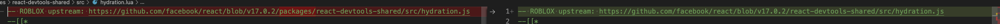
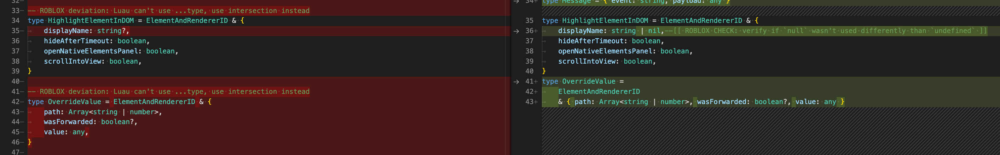
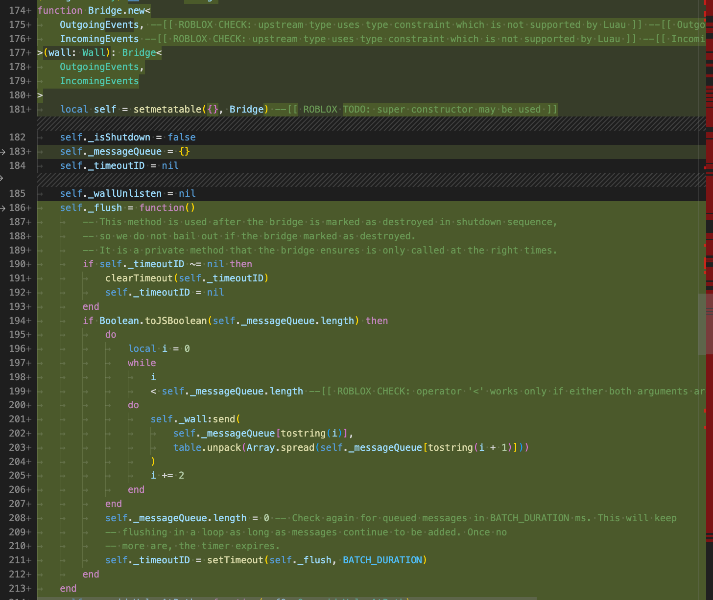
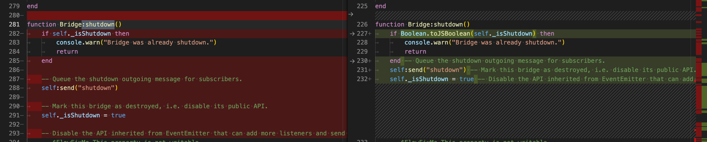

# Aligning files guide

We are aligning files by going through them module by module. We keep track of them in a [Adapt roact-alignment implementation](https://github.com/Roblox/roact-alignment/milestone/1) milestone.

## Prerequisites

In this guide we assume that you have the following project cloned inside of the common directory:
* js-to-lua [repo link](https://github.com/roblox/js-to-lua)
  * checkout `main` branch
* roact-alignment [repo link](https://github.com/roblox/roact-alignment)
  * your working branch on top of `master` branch
* react [repo link](https://github.com/facebook/react)
  * checkout `v17.0.2` tag

## Tools installation

First follow the [README](https://github.com/Roblox/js-to-lua/blob/main/README.md) instructions to set up js-to-lua. The easiest way is to build the tool by running `npx nx build convert-js-to-lua` (from within `js-to-lua` directory)

## Aligning process

I will show you the process based on the `react-devtools-shared` module. All the commands shown below are to be executed from `js-to-lua` directory

Depending on the size of the module and/or your preference you can either align all the files at once or do it file by file. In order to convert the whole module at once you can run the following command

```shell
dist/apps/convert-js-to-lua/index.js \
  --input ../react/packages/react-devtools-shared/src/**/*.js \
  --output ../roact-alignment/modules/ \
  --rootDir ../react/packages \
  --plugin=knownImports --plugin=jestGlobals \
  --babelTransformConfig babel-flow-transform-react.config.json \
  --babelConfig babel-flow.config.json
```

This will run the conversion on all the files in the `react-devtools-shared` which in our case is a bit too much as this module contains a lot of files that haven't been converted yet. That's why for this particular module I chose to go file by file:

```shell
dist/apps/convert-js-to-lua/index.js \
  --input ../react/packages/react-devtools-shared/src/<path_to_a_js_file> \
  --output ../roact-alignment/modules/ \
  --rootDir ../react/packages \
  --plugin=knownImports --plugin=jestGlobals \
  --babelTransformConfig babel-flow-transform-react.config.json \
  --babelConfig babel-flow.config.json
```

eg.

```
dist/apps/convert-js-to-lua/index.js \
  --input ../react/packages/react-devtools-shared/src/utils.js \
  --output ../roact-alignment/modules/ \
  --rootDir ../react/packages \
  --plugin=knownImports --plugin=jestGlobals \
  --babelTransformConfig babel-flow-transform-react.config.json \
  --babelConfig babel-flow.config.json
```

After we run the automatic conversion the file will contain a lot of changes. Please additionally run `stylua module` in the roact-alignment directory to make sure all the files are converted according to the StyLua configuration.

Now our job is to capture the deviations that the original code has made and mark them with appropriate `ROBLOX deviation START` / `ROBLOX deviation END` comments.

There are some special cases which fast-follow treats separately and you don't need to wrap them in a deviation comment:

* upstream comment - with the command shown above there is a small issue with part of the upstream comment not being included. In this case we need to add the missing `packages/` part of the path.
  
* Packages - js-to-lua can't automatically assign a proper path to `Packages` variable right now. However, fast-follow will treat conflicts resulting from this line separately so there is no need to wrap it with deviation comment.
  

We've added a bunch of improvements in js-to-lua to the output code so be mindful that new types might be better left as is straight from the conversion. Also you might encounter a lot of diff when it comes to class conversion. I suggest leaving the class conversion structure as is and only mark deviation inside of the class's methods body.

For example the following diff should not be a deviation anymore:


And with class conversion the following example shows how js-to-lua handles class "methods" which are defined as arrow functions. The body of the function might still need to be marked with deviation blocks but the structure should most probably stay the same

 

As for the actual deviations that need to be marked let's look at the following example. We can see that the call to `Boolean.toJSBoolean` is unnecessary in this case so we can comment-out that line, wrap it with `-- ROBLOX deviation START:` and `-- ROBLOX deviation END` comments and follow the commented out line with the proper implementation.




In order to make that process a little bit easier we've created a set of VSCode snippets that you can use - [link](#snippets) to snippets section. 

## Snippets

You can configure your snippets by invoking `Snippets: Configure User Snippets` command from VSCode's command pallette and choosing `.lua` extension. Below you can find all of the snippets we've used.

In order to use the snippets you should configure a hot key (keyboard shortcut) for `Snippets: Insert Snippet` action. Then you can just select a piece of code that you need to mark with deviation, press the hot key and choose the appropriate snippet:

* `deviation-block` - will comment out the currently selected code, wrap it with deviation START/END comments and insert a duplicated version of the same code for you to tweak
* `deviation-block-skipped` - will do the same as `deviation-block` but won't insert a duplicated code as it's meant for blocks of code that should be skipped
* `deviation-block-add` - will wrap the currently selected block of code with deviation START/END comments and allow you to put an additional code inside. It's intended for some additional blocks of code that were not included in the original conversion. We use a convention of `-- ROBLOX deviation START: add <your_description>` to easily distinguish added and changes sections
* `deviation-start` and `deviation-end` - will only insert a proper deviation start/end comment. We use those to avoid typos.

There are couple more utility snippets for special cases that were occurring more often:
* `deviation-block-type` - it will wrap a block with deviation comments, comment out the block and insert a duplicate but change `local` for `type`. It's useful when js-to-lua imported locals from a module when it should actually import types
* `deviation-line` and `deviation-line-skipped` are similar to their block equivalents but will use the current line instead of selected block of code

```json
{
	"Deviation block - start": {
		"prefix": "deviation-start",
		"body": "-- ROBLOX deviation START: ${0:description}",
		"description": "Roblox deviation start marker"
	},
	"Deviation block - end": {
		"prefix": "deviation-end",
		"body": "-- ROBLOX deviation END",
		"description": "Roblox deviation end marker"
	},
	"Deviation block": {
		"prefix": "deviation-block",
		"body": [
			"-- ROBLOX deviation START: ${0:changed because}",
			"-- ${TM_SELECTED_TEXT/\n/\n-- /g}",
			"$TM_SELECTED_TEXT",
			"-- ROBLOX deviation END"
		],
		"description": "Roblox deviation end marker",
	},
	"Deviation block - type": {
		"prefix": "deviation-block-type",
		"body": [
			"-- ROBLOX deviation START: ${0:import as type instead of local}",
			"-- ${TM_SELECTED_TEXT/\n/\n-- /g}",
			"${TM_SELECTED_TEXT/^local /type /gm}",
			"-- ROBLOX deviation END"
		],
		"description": "Roblox deviation end marker",
	},
	"Deviation block - add": {
		"prefix": "deviation-block-add",
		"body": [
			"-- ROBLOX deviation START: ${0:add some code}",
			"${TM_SELECTED_TEXT}",
			"${1}",
			"-- ROBLOX deviation END"
		],
		"description": "Roblox deviation end marker",
	},
	"Deviation block - skip": {
		"prefix": "deviation-block-skipped",
		"body": [
			"-- ROBLOX deviation START: ${0:changed because}",
			"-- ${TM_SELECTED_TEXT/\n/\n-- /g}",
			"-- ROBLOX deviation END"
		],
		"description": "Roblox deviation end marker",
	},
	"Deviation line": {
		"prefix": "deviation-line",
		"body": ["-- ROBLOX deviation START: ${0:changed because}", "-- $TM_CURRENT_LINE", "$TM_CURRENT_LINE", "-- ROBLOX deviation END"],
		"description": "Roblox deviation end marker"
	},
	"Deviation line - skipped": {
		"prefix": "deviation-line-skipped",
		"body": ["-- ROBLOX deviation START: ${0:changed because}", "-- $TM_CURRENT_LINE", "-- ROBLOX deviation END"],
		"description": "Roblox deviation end marker"
	}
}
```
