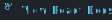

# React

!!! info
	This page is intended to provide *brief* descriptions, examples, and notes about deviations in behavior or API. For complete feature documentation of upstream-aligned features, follow the `View React Docs` link and consult the React JS docs.

The `React` package is the entry point for most React logic and behavior. Most of its API members align directly to their equivalents in [React JS](https://reactjs.org/docs/react-api.html). Some API members have slightly different behavior, different guidance around their usage, or slightly different function signatures to better accommodate Luau functionality and idioms.

### API Deviations

#### Not Supported
The following API members are notable absences relative to React JS 17.0.1:

* `React.createFactory` - Considered legacy and will likely not be included
* `React.useDebugValue` - Not yet implemented

Additionally, the following APIs are implemented, but have blocking issues that prevent them from being fully supported or usable:

* [`React.lazy`](#reactlazy)
* [`React.Suspense`](#reactsuspense)

#### Undocumented
The `React` packages includes some features that are undocumented in React JS 17.0.1, but are present in its implementation. The following API members may be less stable than the features that are fully documented upstream:

* [`React.createMutableSource`](#reactcreatemutablesource)
* [`React.useMutableSource`](#reactusemutablesource)

#### Unique to Roblox
`React` also exports a small collection of [Roact-exclusive APIs](#roblox-and-luau) which have no upstream equivalent. These are designed to facilitate better integration with the Luau language and the Roblox engine functionality.

* [`React.None`](#reactnone)
* [`React.Event`](#reactevent)
* [`React.Change`](#reactchange)
* [`React.Tag`](#reacttag)
* [`React.useBinding`](#reactusebinding)
* [`React.createBinding`](#reactcreatebinding)
* [`React.joinBindings`](#reactjoinbindings)

## React.Component
<a href='https://beta.reactjs.org/reference/react/Component' target="_blank"></a> 

Luau does not have ES6's class semantics, so class components work slightly differently from React JS in the following ways:

* Use `Component:extend` in place of ES6 class semantics
* Implement an `init` method on components instead of a constructor

Roact 17 also includes the following deviations:

* Instead of initializing component state by assigning a value to `self.state` in the `init` method, use `setState` as you would elsewhere (this is inherited from Legacy Roact for compatibility and consistency)
* Error boundaries are not fully supported in Roact 17 at this time due to a limitation in recursive `pcall` depth

```lua
local MyComponent = React.Component:extend("MyComponent")

function MyComponent:init()
	self:setState({ expanded = true })
end

function MyComponent:render()
	return React.createElement("TextButton", {
		Text = if expanded
			then self.props.text
			else "Click to Expand",
		Size = if expanded
			then UDim2.new(1, 0, 0, 200)
			else UDim2.new(1, 0, 0, 30),
		[React.Event.Activated] = function()
			self:setState(function(expanded)
				return { expanded = not expanded }
			end)
		end
	})
end
```

Check the [deviations guide](../deviations.md#class-components) for more detailed information.

## React.PureComponent
<a href='https://beta.reactjs.org/reference/react/PureComponent' target="_blank"></a> 

The same deviations to `React.Component` apply equivalently to `React.PureComponent`. Check the [deviations guide](../deviations.md#class-components) for more detailed information.

## React.memo
<a href='https://beta.reactjs.org/reference/react/memo' target="_blank"></a> 

```lua
local MyComponent = React.memo(function MyComponent(props)
	--[[ render using props ]]
end)
```

Guidance specified in the [React documentation](https://beta.reactjs.org/reference/react/memo#usage) applies for Roact as well. Use this only as a performance optimization, and only when relevant to the use case.

## React.createElement
<a href='https://beta.reactjs.org/reference/react/createElement' target="_blank"></a> 

While the `createElement` API is aligned to React JS, current tooling in Luau does not support an equivalent for JSX. When writing Roact code, you'll use `createElement` directly much more often than in React JS.

```lua
--[[
React.createElement(
	type,
	[props],
	[...children]
)
]]
local element = React.createElement(
	"Frame",
	{ Size = UDim2.fromScale(1, 1) },
	React.createElement("TextLabel", { Text = "Child1" })
	React.createElement("TextLabel", { Text = "Child2" })
)
```

## React.cloneElement
<a href='https://beta.reactjs.org/reference/react/cloneElement' target="_blank"></a> 

Clone an existing element, using its provided config values (props, `ref`, and `key`) as a starting point.

```lua
local onlyChild = React.Children.only(props.children)
local cloned = React.cloneElement(onlyChild, { Text = "Cloned" })
```

## React.isValidElement
<a href='https://beta.reactjs.org/reference/react/isValidElement' target="_blank"></a> 

Returns `true` if the provided value is a React element; otherwise, returns `false`.

```lua
if React.isValidElement(props.frameContents) then
	return React.createElement("Frame", { Size = UDim2.fromScale(1, 1) }, props.frameContents)
end
```

## React.Children
<a href='https://beta.reactjs.org/reference/react/Children' target="_blank"></a> 

!!! warning
	This field can often be confused with a Legacy Roact API ca	lled `Roact.Children`. In the legacy API, `Roact.Children` was a special opaque prop key that could be used to pass children through props tables. In Roact 17, the `children` string key is reserved and used instead. Learn more about how to migrate away from `Roact.Children` in the [migration guide](../migrating-from-1x/convert-legacy-conventions.md#reserved-keys).

A collection of utilities for manipulating the children provided to a React component via `props.children` or `self.props.children`. The `children` property should always be used as an opaque data structure; manipulate it via `React.Children` utilities rather than accessing it directly.

There are a few notable deviations:

* React Children values with type "userdata" will be treated as nil in callbacks. This means that a `React.None` child passed to `React.Children.forEach` or `React.Children.map` will be treated the same as a nil value or boolean in the callbacks. `React.Children.count` will not include userdata children in the count.
* The `context` argument for mapChildren is not passed to the callback. This is typically used to pass `this` in javascript, but does not have an equivalent in lua.
* React Children utilities work with tables with string keys as well as arrays


### React.Children.map
<a href='https://beta.reactjs.org/reference/react/Children#children-map' target="_blank"></a> 

Use `React.Children.map` to transform each member child of the `children` property.

```lua
local ListItem = require(script.Parent.ListItem)

local function OrderedList(props)
	return React.createElement(
		"Frame",
		{ Size = UDim2.fromScale(1, 1) },
		React.Children.map(props.children, function(child, i)
			return React.createElement(ListItem, { layoutOrder = i }, child)
		end)
	)
end
```

### React.Children.forEach
<a href='https://beta.reactjs.org/reference/react/Children#children-foreach' target="_blank"></a> 

Accepts a function that will be called with each member child of the `children` property. Similar to `React.Children.map`, but the provided callback does not return a new child.

```lua
local ListItem = require(script.Parent.ListItem)
local Separator = require(script.Parent.Separator)

local function SeparatorList(props)
	local listItems = {}

	React.Children.forEach(props.children, function(child, i)
		table.insert(listItems, React.createElement(ListItem, { layoutOrder = i*2 }, child))
		table.insert(listItems, React.createElement(Separator, { layoutOrder = i*2 + 1 }))
	end)

	return React.createElement(
		"Frame",
		{ Size = UDim2.fromScale(1, 1) },
		listItems
	)
end
```

### React.Children.count
<a href='https://beta.reactjs.org/reference/react/Children#children-count' target="_blank"></a> 

Returns the number of child members in the provided `children` object.

```lua
local function List(props)
	print(string.format("Render list with %d children", React.Children.count(props.children)))

	return React.createElement(
		"Frame",
		{ Size = UDim2.fromScale(1, 1) },
		props.children,
	)
end
```

### React.Children.only
<a href='https://beta.reactjs.org/reference/react/Children#children-only' target="_blank"></a> 

Asserts that the provided object is a single React element. If the provided object is an array or table of elements, this function will throw; otherwise, it returns the element that was passed into it.

```lua
local function Box(props)
	local element = React.Children.only(props.children)

	return React.createElement(
		"Frame",
		{ Size = UDim2.fromOffset(100, 100) },
		element,
	)
end
```

### React.Children.toArray
<a href='https://beta.reactjs.org/reference/react/Children#children-toarray' target="_blank"></a> 

Converts the opaque `children` prop into an array. The resulting value can then be manipulated with typical Lua array semantics or using utility methods that operate on array-like Lua tables.

```lua
local Array = require(Packages.Collections).Array

local function FilteredList(props)
	local children = React.Children.toArray(props.children)

	return React.createElement(
		"Frame",
		{ Size = UDim2.fromScale(1, 1) },
		Array.filter(children, props.filterFn),
	)
end
```

## React.Fragment
<a href='https://beta.reactjs.org/reference/react/Fragment' target="_blank"></a> 

Renders multiple components using a special component called a `Fragment`. Fragments are useful for returning multiple elements from a single component without creating additional Instances in the DataModel.

```lua
function MyComponent:render()
	return React.createElement(
		React.Fragment,
		nil,
		React.createElement("TextLabel", { Text = "Some text." }),
		React.createElement("TextButton", { Text = "Button" }),
	)
end
```

## React.createRef
<a href='https://beta.reactjs.org/reference/react/createRef' target="_blank"></a> 

Creates a Ref object which can be used to access underlying Instances in the DataModel. Use this as an escape hatch when you need to interact directly with Roblox Instances.

```lua
local MyComponent = React.Component:extend("MyComponent")

function MyComponent:init()
	self.inputRef = React.createRef()
end

function MyComponent:render()
	return React.createElement("TextBox", { ref = self.inputRef })
end

function MyComponent:componentDidMount()
	self.inputRef.current:CaptureFocus()
end
```

## React.forwardRef
<a href='https://beta.reactjs.org/reference/react/forwardRef' target="_blank"></a> 

In some cases, you may want your component to accept a ref and forward it to a child, typically a Roblox host component.

`React.forwardRef` accepts a render function that receives `props` (just like a function component) as well as a `ref` object, and can then assign its ref within the render callback.

```lua
local FancyButton = React.forwardRef(function(props, ref)
	return React.createElement("TextButton", {
		ref = ref,
		Text = props.text,
		[React.Event.Activated] = props.onActivated,
	}, props.children)
end)

-- You can now get a ref directly to the TextButton Instance:
local ref = React.createRef()
React.createElement(FancyButton, { ref = ref, text = "Click me!" })
```

## React.createContext
<a href='https://beta.reactjs.org/reference/react/createContext' target="_blank"></a> 

Creates a Context object. Context is a mechanism for passing information through many levels of the React component tree without needing to explicitly pass it down at each level.

```lua
local MyContext = React.createContext(defaultValue)
```

### Context.Provider
<a href='https://beta.reactjs.org/reference/react/createContext#provider' target="_blank"></a> 

The Context object returned from `createContext` includes a `Provider` component, which can be used to pass a context value into the component tree.

```lua
React.createElement(MyContext.Provider, { value = someValue })
```

### Context.Consumer
<a href='https://beta.reactjs.org/reference/react/createContext#consumer' target="_blank"></a> 

The Context object returned from `createContext` includes a `Consumer` component, which can be used to retrieve a context value that was provided higher up in the tree.

```lua
React.createElement(MyContext.Consumer, nil, function(value)
	-- render something based on the context value
end)
```

## React.lazy
<a href='https://beta.reactjs.org/reference/react/lazy' target="_blank"></a> 

!!! warning
	Though `React.lazy`'s functionality is implemented, it may not be especially useful without complete support for [`React.Suspense`](#reactsuspense).

!!! warning
	The `lazy` utility is designed an ecosystem where loading modules can be expensive. **This is rarely a concern in the context of Luau projects.** Since `lazy` relies upon a dynamic call to `require`, tooling like type checking may not work correctly. Use `React.lazy` with caution and intent, and only if it has a measurable performance impact.

Wraps a component in a lazy-loading container that waits until the component is used in a render before calling the function to load it.

```lua
local Component = React.lazy(function()
	return require(script.Parent.Component)
end)
```


## React.Suspense
<a href='https://beta.reactjs.org/reference/react/Suspense' target="_blank"></a> 

!!! warning
	**While `React.Suspense` is technically implemented, it should be considered unusable as of version `17.0.1`.** This is due to a limitation in Luau around recursive `pcall` depth. Future updates to React will unravel the recursive traversal and enable these features.
	Future version of React eliminate this recursive structure and should enable full use of `Suspense` and error boundaries.

Renders a subtree of children that can yield. If the children suspend while rendering, the `fallback` field provided will be used until the children have resolved their render.

```lua
React.createElement(
	React.Suspense,
	{
		fallback = React.createElement("TextLabel", {
			Text = "Loading...",
		})
	},
	React.createElement(SomeContents)
)
```

## Hooks

Hooks allow simple function components to introduce stateful behaviors without incurring the overhead or complexity of the full [Component](#reactcomponent) lifecycle.

### React.useState
<a href='https://beta.reactjs.org/reference/react/useState' target="_blank"></a> 

`useState` is a React Hook that creates a state variable that can be used and updated by your component. Updating the state will cause the component to re-render.

```lua
local function ClickCounter(props)
	local count, setCount = React.useState(0)

	return React.createElement("TextButton", {
		Text = string.format("Clicked %d times", count)
		-- Clicking the button updates the count, which re-renders the component
		[React.Event.Activated] = function()
			setCount(count + 1)
		end
	})
end
```

Note that Luau does not have syntactic sugar for destructuring like javascript:
```js
const [value, setValue] = useState(0);
```
However, it _does_ support multiple return values, so Roact 17 supports a very similar usage:
```lua
local value, setValue = useState(0)
```

### React.useEffect
<a href='https://beta.reactjs.org/reference/react/useEffect' target="_blank"></a> 

`useEffect` is a React Hook that causes a side effect to run after a component's render has completed, allowing synchronization with external systems.

```lua
local UserInputService = game:GetService("UserInputService")
local LastInputTypeChanged = UserInputService.LastInputTypeChanged

local function LastInputLabel(props)
	local lastInput, setLastInput = React.useState(Enum.UserInputType.None)

	React.useEffect(function()
		-- Update `lastInput` state when the engine signal fires
		local connection = LastInputTypeChanged:Connect(setLastInput)

		return function()
			connection:Disconnect()
		end
	end)

	return React.createElement("TextLabel", {
		Text = string.format("Last input: %s", lastInput)
	})
end
```

### React.useContext
<a href='https://beta.reactjs.org/reference/react/useContext' target="_blank"></a> 

`useContext` is a React Hook that allows a component to read from and subscribe to context values provided from [`createContext`](#reactcreatecontext).

```lua
local ThemeContext = require(...)

local function ThemedLabel(props)
	local theme = React.useContext(ThemeContext)

	return React.createElement("TextLabel", {
		TextSize = theme.TextSize,
		TextColor3 = theme.TextColor3,
		-- ...
	})
end
```

### React.useReducer
<a href='https://beta.reactjs.org/reference/react/useReducer' target="_blank"></a> 

`useReducer` is a React Hook that introduces a reducer function to your component for managing complex state. See the [`Rodux` documentation](https://roblox.github.io/rodux/introduction/reducers/) for detailed examples of the reducer pattern in Lua.

```lua
local function reducer(state, action)
	if action.type == "add" then
		return {
			value = state.value + action.value,
			ops = state.ops + 1,
		}
	elseif action.type == "multiply" then
		return {
			value = state.value * action.value,
			ops = state.ops + 1,
		}
	end
end

local function Calculator(props)
	local state, dispatch = React.useReducer(reducer, { value = 1, ops = 0 })

	return React.createElement(React.Fragment, nil,
		React.createElement("TextLabel", {
			Text = string.format("value: %d - ops: %d", state.value, state.ops)
		})
		React.createElement("TextButton", {
			Text = "Add 4",
			[React.Event.Activated] = function()
				dispatch({ type = "add", value = 4 })
			end
		})
		React.createElement("TextButton", {
			Text = "Multiply by 3",
			[React.Event.Activated] = function()
				dispatch({ type = "multiply", value = 3 })
			end
		})
	)
end
```

Just like the `useState` hook, we use Luau's multiple returns to approximate JavaScript's destructuring. The following JS:
```js
const [state, dispatch] = useReducer(reducer, initialState);
```
However, it _does_ support multiple return values, so Roact 17 supports a very similar usage:
```lua
local state, dispatch = useReducer(reducer, initialState)
```

### React.useCallback
<a href='https://beta.reactjs.org/reference/react/useCallback' target="_blank"></a> 

`useCallback` is a React Hook that allows a component to cache a function definition between re-renders.

```lua
local ItemTile = require(...)
local equipItem = require(...)

local function EquippableItemTile(props)
	local onClick = React.useCallback(function()
		equipItem(props.itemId)
	end, { props.itemId })

	return React.createElement(ItemTile, {
		text = props.itemName,
		onTileClicked = onClick,
	})
end
```

### React.useMemo
<a href='https://beta.reactjs.org/reference/react/useMemo' target="_blank"></a> 

`useMemo` is a React Hook that caches a computed value between re-renders.

```lua
local function filterByCategory(todos, category)
	-- ...
	return filteredTodos
end

local function FilteredTodoList(props)
	local filteredTodos = React.useMemo(function()
		return filterByCategory(props.todos, props.selectedCategory)
	end, { props.todos, props.selectedCategory })

	return React.createElement(TodoList, {
		items = filteredTodos,
	})
end
```

### React.useRef
<a href='https://beta.reactjs.org/reference/react/useRef' target="_blank"></a> 

`useRef` is a React Hook that stores a value that's not needed for rendering. In other words, refs are arbitrary value containers that do no invoke re-renders when they change.

Refs can be used for a variety of purposes, including assigning them to the `ref` field of an element to get a reference to the underlying Roblox `Instance`.

```lua
local function TextBoxWithButton(props)
	local textBoxRef = React.useRef(nil)

	return React.createElement(React.Fragment, nil,
		React.createElement("TextBox", { ref = textBoxRef }),
		React.createElement("TextButton", {
			Text = "->",
			[React.Event.Activated] = function()
				textBoxRef.current:CaptureFocus()
			end
		}),
	)
end
```

### React.useImperativeHandle
<a href='https://beta.reactjs.org/reference/react/useImperativeHandle' target="_blank"></a> 

`useImperativeHandle` is a React Hook that provides a way to customize a handle that's exposed as a ref.

This allows a ref to be defined around a narrower or more convenient interface rather than a direct reference to the underlying `Instance`, and can be used to expose a customized ref interface from a function or class component.

```lua
local ControllableScrollingFrame = React.forwardRef(function(props, ref)
	local innerRef = React.useRef(nil)

	React.useImperativeHandle(ref, function()
		return {
			scrollToTop = function()
				innerRef.current.CanvasPosition = Vector2.new(0, 0)
			end
		}
	end, {})

	return React.createElement("ScrollingFrame", {
		ref = innerRef
		-- ...
	})
end)

-- Another component will be able to access this interface via a ref:
local function TodoListApp(props)
	local scrollingFrameRef = React.useRef(nil)

	return React.createElement(ControllableScrollingFrame,
		{
			ref = scrollingFrameRef
		},
		React.createElement(TodoList, {
			items = props.todoItems,
		}),
		React.createElement("TextButton", {
			Text = "Back to top",
			[React.Event.Activated] = function()
				scrollingFrameRef.current.scrollToTop()
			end
		})
	)
end
```

### React.useLayoutEffect
<a href='https://beta.reactjs.org/reference/react/useLayoutEffect' target="_blank"></a> 

`useLayoutEffect` is an alternative version of `useEffect` that fires after the component runs its render function, but before the Roblox `Instance` hierarchy is reconciled with the new properties.

!!! caution
	Use this hook sparingly. While `useEffect` runs asynchronously after a render operation is completed, `useLayoutEffect` runs _during_ an update in between rendering and reconciliation: this can introduce performance issues if used carelessly.

	In React JS, `useLayoutEffect` is most often used to measure and position elements before the browser repaints them. It's not yet clear how this use case translates to roblox usage, and this hook should be used with caution until performance is investigated in detail and best practices emerge.

### React.useBinding


A hook introduced in Roact that creates a `Binding` object. Bindings are isolated containers that automatically update. Creates and returns a binding and its associated updater function as multiple return values, [similar to `useState`](#reactusestate).

```lua
local function DisplaysSize(props)
	local absSize, setAbsSize = React.useBinding(Vector2.new(0, 0))
	return React.createElement(React.Fragment, nil,
		React.createElement("ImageLabel", {
			Image = props.image,
			[React.Change.AbsoluteSize] = function(rbx)
				setAbsSize(rbx.AbsoluteSize)
			end,
		}),
		React.createElement("TextLabel", {
			Text = absSize:map(function(value)
				return "X = " .. tostring(value.X) .. "; Y = " .. tostring(value.Y)
			end)
		}
	)
end
```

A `Binding` has the following API:

#### getValue

!!! warning
	Using `getValue` inside a component's `render` method is likely to result in using stale values! Using the unwrapped value directly won't allow Roact to subscribe to a binding's updates. To guarantee that a bound value will update, use the binding itself for your prop value or use the `map` method to map the value to a new one.

Returns the internal value of the binding. This is helpful when updating a binding relative to its current value.

```lua
local function UpdateOnClick()
	local count, setCount = React.useBinding(0)

	return React.createElement("TextButton", {
		Text = count,
		[React.Event.Activated] = function()
			setCount(count:getValue() + 1)
		end,
	})
end
```

#### map

Returns a new binding that maps the existing binding's value to something else. For example, `map` can be used to transform an animation progress value like `0.4` into a property that can be consumed by a Roblox Instance like `UDim2.new(0.4, 0, 1, 0)`.

In function components, the `useBinding` hook provides equivalent functionality, and guarantees that it will return the same binding and updater objects on subsequent calls (just like `useRef` does).

```lua
local function UpdateOnClick()
	local count, setCount = React.useBinding(0)

	return React.createElement("TextButton", {
		Text = count:map(function(value)
			return string.format("Clicked %d times", value)
		end),
		[React.Event.Activated] = function()
			setCount(count:getValue() + 1)
		end,
	})
end
```

## React.Profiler
Refer to [React Profiler API documentation](https://beta.reactjs.org/reference/react/Profiler).

## React.StrictMode
Refer to [React StrictMode API documentation](https://beta.reactjs.org/reference/react/StrictMode).

## React.createMutableSource
Refer to [relevant React RFC](https://github.com/reactjs/rfcs/pull/147).

## React.useMutableSource
Refer to [relevant React RFC](https://github.com/reactjs/rfcs/pull/147).

## Roblox and Luau

The React package shipped from Roact includes certain APIs designed specifically to account for nuances of the Luau language and to more easily leverage Roblox engine features.

These APIs are unique to Roact and do not have equivalents in React JS.

### React.None


A placeholder value that can be used to remove fields from a table (by changing the value to nil) when merging tables. This allows state fields to be nil-able despite lua treating table fields with `nil` values as semantically equivalent to absent fields.

`React.None` can be used to remove values from React class component state via these uses:

* When returning a table from the updater function passed to a class component's [`setState`]() method
	```lua
	self:setState(function(_prevState)
		return { myStateValue = React.None }
	end)
	```
* When passing a table directly to a class component's `setState` method
	```lua
	self:setState({ myStateValue = React.None })
	```
* When returning a table from a component's `getDerivedStateFromProps` implementation
	```lua
	function MyComponent.getDerivedStateFromProps(props, state)
		return {
			value = if props.someCondition
				then state.value
				else React.None
		}
	end
	```

!!! caution
	`React.None` should be used sparingly; component state fields can generally be expressed more clearly with enumerated values or reasonable defaults than with nil-able values.

	Additionally, `React.None` is not intended to be used as a prop value, and may be reverted to nil by internal React logic in some cases if it's provided as one.

### React.Event


A special key that can be used to interact with [events on Roblox Instance objects](https://developer.roblox.com/en-us/api-reference/function/Instance/GetPropertyChangedSignal). Index into `Roact.Event` with the name of an Event that's defined for the given host Instance class in order to get a special prop key that connects to that event:

```lua
Roact.createElement("ImageButton", {
	[React.Event.MouseButton1Click] = function(rbx, x, y)
		print(rbx, "clicked at position", x, y)
	end,
})
```

The event connection will be automatically created when the host element is mounted and automatically disconnected when the element is unmounted.

!!! info
	Event callbacks receive the Roblox Instance as the first parameter, followed by any parameters yielded by the event.

### React.Change


A special key that can be used to interact with the [`GetPropertyChangedSignal` method on Roblox Instance objects](https://developer.roblox.com/en-us/api-reference/function/Instance/GetPropertyChangedSignal). Index into `Roact.Change` with the name of the property to get a special prop key that connects to the change signal of an Instance with that property:

```lua
Roact.createElement("ScrollingFrame", {
	[React.Change.CanvasPosition] = function(rbx)
		print("ScrollingFrame scrolled to", rbx.CanvasPosition)
	end,
})
```

The change signal connection will be automatically created when the host element is mounted and automatically disconnected when the element is unmounted.

### React.Tag


```lua
local button = Roact.createElement("TextButton", {
	[React.Tag] = "confirm-button"
	Text = "Confirm",
	-- ...
})
```

A special key that can be used to apply [`CollectionService`](https://developer.roblox.com/en-us/api-reference/class/CollectionService) tags to a host component.

Multiple tags can be provided as a single space-delimited string. For example:
```lua
[React.Tag] = "some-tag some-other-tag"
```
will apply "some-tag" and "some-other-tag" as `CollectionService` tags to the underlying Roblox Instance when the component is mounted.

### React.createBinding


Creates a binding object. This function can be used outside of React function components and works similarly to [`useBinding`](#reactusebinding).

Use `createBinding` when you'd like to use a binding within a class component:

```lua
local DisplaysSize = React.Component:extend("DisplaysSize")

function DisplaysSize:init()
	self.absSize, self.setAbsSize = React.createBinding(Vector2.new(0, 0))
end

function DisplaysSize:render()
	return React.createElement(React.Fragment, nil,
		React.createElement("ImageLabel", {
			Image = self.props.image,
			[React.Change.AbsoluteSize] = function(rbx)
				self.setAbsSize(rbx.AbsoluteSize)
			end,
		}),
		React.createElement("TextLabel", {
			Text = self.absSize:map(function(value)
				return "X = " .. tostring(value.X) .. "; Y = " .. tostring(value.Y)
			end)
		}
	)
end
```

### React.joinBindings


Combines a map or array of bindings into a single binding. The new binding's value will have the same keys as the input table of bindings. Each time any of the input bindings update, the resulting binding will update as well with a new value.

This capability can be used to create a single binding value that responds to changes from several input bindings:
```lua
local function Flex()
	local aSize, setASize = React.useBinding(Vector2.new())
	local bSize, setBSize = React.useBinding(Vector2.new())

	return React.createElement(
		"Frame",
		{
			Size = React.joinBindings({aSize, bSize}):map(function(sizes)
				local sum = Vector2.new()

				for _, size in sizes do
					sum += size
				end

				return UDim2.new(0, sum.X, 0, sum.Y)
			end),
		},
		React.createElement("Frame", {
			Size = UDim2.new(1, 0, 0, 30),
			[React.Change.AbsoluteSize] = function(instance)
				setASize(instance.Size)
			end,
		}),
		React.createElement("Frame", {
			Size = UDim2.new(1, 0, 0, 30),
			Position = aSize:map(function(size)
				return UDim2.new(0, 0, 0, size.Y)
			end),
			[React.Change.AbsoluteSize] = function(instance)
				setBSize(instance.Size)
			end,
		})
	)
end
```

